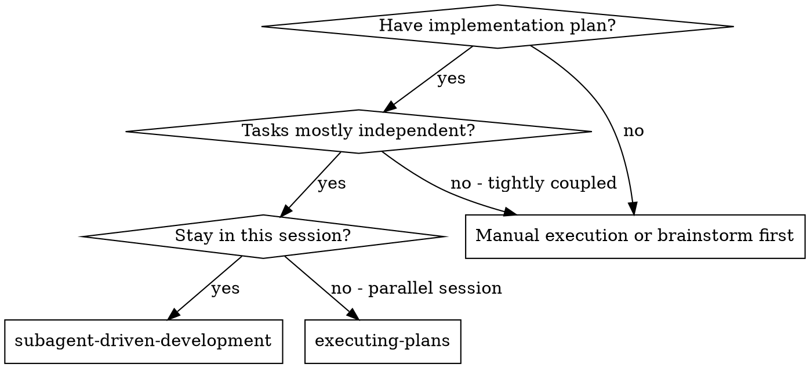
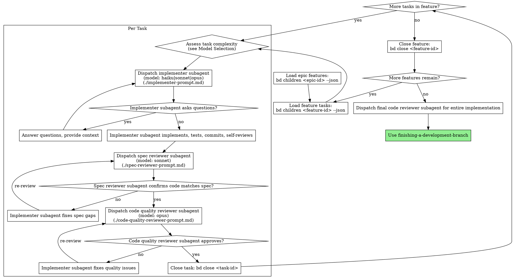

# Subagent-Driven Development

Execute plan by dispatching fresh subagent per task, with two-stage review after each: spec compliance review first, then code quality review.

**Why subagents:** You delegate tasks to specialized agents with isolated context. By precisely crafting their instructions and context, you ensure they stay focused and succeed at their task. They should never inherit your session's context or history — you construct exactly what they need. This also preserves your own context for coordination work.

**Core principle:** Fresh subagent per task + two-stage review (spec then quality) = high quality, fast iteration

## When to Use



**vs. Executing Plans (parallel session):**
- Same session (no context switch)
- Fresh subagent per task (no context pollution)
- Two-stage review after each task: spec compliance first, then code quality
- Faster iteration (no human-in-loop between tasks)

## The Process



## Model Selection

Use the least powerful model that can handle each role. Start cheap, escalate on failure.

The Agent tool accepts `model: "haiku" | "sonnet" | "opus"`. Use this table:

| Role | Model | Why |
|------|-------|-----|
| Implementer (mechanical) | `haiku` | Clear spec, 1-2 files, plan provides code snippets. Review stages catch mistakes. |
| Implementer (integration) | `sonnet` | Multi-file coordination, message passing, pattern matching. |
| Implementer (complex) | `opus` | Design judgment, broad codebase understanding, architectural decisions. |
| Spec reviewer | `sonnet` | Structured comparison: spec vs. code. Doesn't require deep judgment. |
| Code quality reviewer | `opus` | Judgment-heavy: naming, coupling, maintainability, design smell detection. |
| Final reviewer | `opus` | Holistic assessment across entire implementation. |

**Most implementation tasks are mechanical when the plan is well-specified.** Plans from writing-plans include code snippets, file paths, and acceptance criteria — enough context for haiku to succeed.

**Complexity signals for implementers:**
- Touches 1-2 files with a complete spec → `haiku`
- Touches multiple files with integration concerns → `sonnet`
- Requires design judgment or broad codebase understanding → `opus`

**Escalation is the safety net:** If haiku reports BLOCKED, re-dispatch with sonnet. If sonnet reports BLOCKED, re-dispatch with opus. Never retry the same model without changing something (see Handling Implementer Status).

## Handling Implementer Status

Implementer subagents report one of four statuses. Handle each appropriately:

**DONE:** Proceed to spec compliance review.

**DONE_WITH_CONCERNS:** The implementer completed the work but flagged doubts. Read the concerns before proceeding. If the concerns are about correctness or scope, address them before review. If they're observations (e.g., "this file is getting large"), note them and proceed to review.

**NEEDS_CONTEXT:** The implementer needs information that wasn't provided. Provide the missing context and re-dispatch.

**BLOCKED:** The implementer cannot complete the task. Assess the blocker:
1. If it's a context problem, provide more context and re-dispatch with the same model
2. If the task requires more reasoning, re-dispatch with a more capable model
3. If the task is too large, break it into smaller pieces
4. If the plan itself is wrong, escalate to the human

**Never** ignore an escalation or force the same model to retry without changes. If the implementer said it's stuck, something needs to change.

## Prompt Templates

- `./implementer-prompt.md` - Dispatch implementer subagent
- `./spec-reviewer-prompt.md` - Dispatch spec compliance reviewer subagent
- `./code-quality-reviewer-prompt.md` - Dispatch code quality reviewer subagent

## Example Workflow

```
You: I'm using Subagent-Driven Development to execute this plan.

[Load epic features: bd children <epic-id> --json]

--- Feature 1 (bd-feat1): Hook system ---

[Load feature tasks: bd children bd-feat1 --json]

Task 1 (bd-abc): Hook installation script
  Complexity: 1-2 files, clear spec with code snippets → model: haiku

[bd update bd-abc --claim]
[Read task design from bd show bd-abc]
[Dispatch implementer subagent (model: haiku) with full task text + context]

Implementer: "Before I begin - should the hook be installed at user or system level?"

You: "User level (~/.local/share/my-app/hooks/)"

[Re-dispatch implementer (model: haiku) with answer + full context]
Implementer:
  - Implemented install-hook command
  - Added tests, 5/5 passing
  - Self-review: Found I missed --force flag, added it
  - Committed

[Dispatch spec reviewer (model: sonnet)]
Spec reviewer: ✅ Spec compliant - all requirements met, nothing extra

[Get git SHAs, dispatch code quality reviewer (model: opus)]
Code reviewer: Strengths: Good test coverage, clean. Issues: None. Approved.

[bd close bd-abc --reason "Implemented"]

Task 2 (bd-def): Recovery modes
  Complexity: multi-file, integration with hook system → model: sonnet

[bd update bd-def --claim]
[Dispatch implementer subagent (model: sonnet) with full task text + context]
...reviews pass (spec: sonnet, quality: opus)...

[bd close bd-def --reason "Implemented"]

[All tasks in feature done — close feature]
[bd close bd-feat1 --reason "All tasks complete"]

--- Feature 2 (bd-feat2): Verification ---

[Load feature tasks: bd children bd-feat2 --json]

Task 3 (bd-ghi): Verify command
  Complexity: design judgment, broad codebase understanding → model: opus

[Dispatch implementer subagent (model: opus) with full task text + context]
...implement, review (spec: sonnet, quality: opus), close...
[bd close bd-ghi --reason "Implemented"]

[All tasks in feature done — close feature]
[bd close bd-feat2 --reason "All tasks complete"]

--- All features complete ---

[bd children <epic-id> shows all features closed — epic auto-closes]
[Dispatch final code reviewer (model: opus)]
Final reviewer: All requirements met, ready to merge

Done!
```

## Advantages

**vs. Manual execution:**
- Subagents follow TDD naturally
- Fresh context per task (no confusion)
- Parallel-safe (subagents don't interfere)
- Subagent can ask questions (before AND during work)

**vs. Executing Plans:**
- Same session (no handoff)
- Continuous progress (no waiting)
- Review checkpoints automatic

**Efficiency gains:**
- No file reading overhead (controller provides full text)
- Controller curates exactly what context is needed
- Subagent gets complete information upfront
- Questions surfaced before work begins (not after)

**Quality gates:**
- Self-review catches issues before handoff
- Two-stage review: spec compliance, then code quality
- Review loops ensure fixes actually work
- Spec compliance prevents over/under-building
- Code quality ensures implementation is well-built

**Cost:**
- More subagent invocations (implementer + 2 reviewers per task)
- Controller does more prep work (extracting all tasks upfront)
- Review loops add iterations
- But catches issues early (cheaper than debugging later)

## Red Flags

**Never:**
- Dispatch any subagent without explicitly setting the `model:` parameter (see Model Selection table)
- Start implementation on main/master branch without explicit user consent
- Skip reviews (spec compliance OR code quality)
- Proceed with unfixed issues
- Dispatch multiple implementation subagents in parallel (conflicts)
- Make subagent read bd issues directly (provide full text instead)
- Let subagents create bd issues, push to remote, or create PRs (controller manages all of these)
- Skip scene-setting context (subagent needs to understand where task fits)
- Ignore subagent questions (answer before letting them proceed)
- Accept "close enough" on spec compliance (spec reviewer found issues = not done)
- Skip review loops (reviewer found issues = implementer fixes = review again)
- Let implementer self-review replace actual review (both are needed)
- **Start code quality review before spec compliance is ✅** (wrong order)
- Move to next task while either review has open issues
- Close a parent task without checking for stale subtasks created by subagents

**If subagent asks questions:**
- Answer clearly and completely
- Provide additional context if needed
- Don't rush them into implementation

**If reviewer finds issues:**
- Implementer (same subagent) fixes them
- Reviewer reviews again
- Repeat until approved
- Don't skip the re-review

**If subagent fails task:**
- Dispatch fix subagent with specific instructions
- Don't try to fix manually (context pollution)

## Integration

**Required workflow skills:**
- **using-git-worktrees** - REQUIRED: Set up isolated workspace before starting
- **writing-plans** - Creates the bd task hierarchy this skill executes
- **requesting-code-review** - Code review template for reviewer subagents
- **finishing-a-development-branch** - Complete development after all tasks

**Subagents should use:**
- **test-driven-development** - Subagents follow TDD for each task

**Alternative workflow:**
- **executing-plans** - Use for parallel session instead of same-session execution
