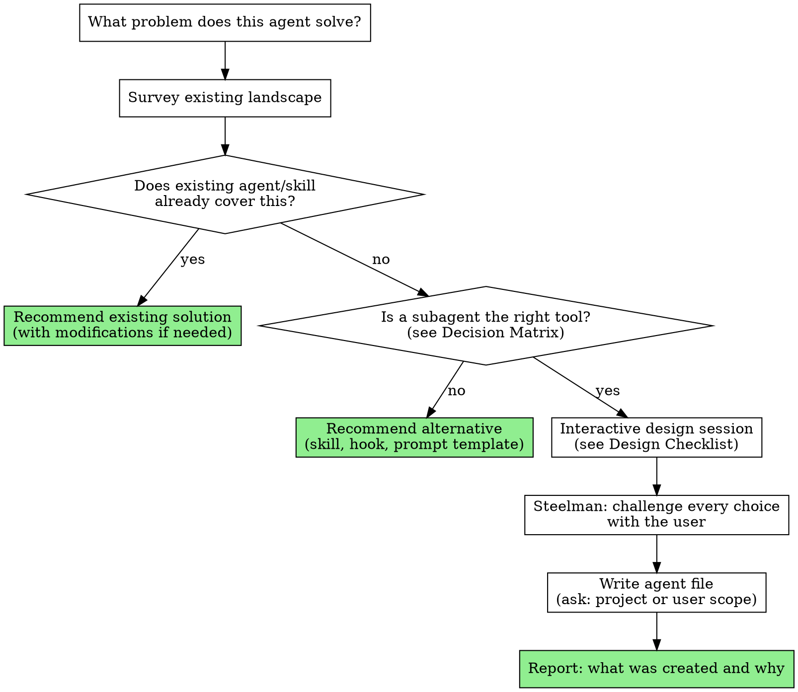

# Writing Agents

Design and create custom subagents through interactive steelmanning. Ensures agents are the right tool, avoids duplicating existing capabilities, and produces focused, token-efficient agent definitions.

**Core principle:** Think before building. Most agent requests are better served by existing skills or agents.

## The Process

## Step 1: Understand the Problem

Before anything else, articulate what the agent will do. Ask:

- What task does this agent perform?
- When should it be triggered?
- What does it produce (report, code changes, verdict)?
- Who/what invokes it (user, another skill, automation)?

## Step 2: Survey Existing Landscape

**YOU MUST** check before building:

1. List all existing agents: `ls .claude/agents/` and `ls ~/.claude/agents/`
2. List all existing skills: `ls .claude/skills/`
3. Check built-in agents: Explore, Plan, general-purpose, Bash, claude-code-guide
4. Read any agent/skill that might overlap with the proposed function

If an existing agent or skill covers 70%+ of the need, recommend extending it rather than creating a new one. Present the overlap analysis to the user.

## Step 3: Is a Subagent the Right Tool?

### Decision Matrix

| Need | Right tool | Why |
|------|-----------|-----|
| Isolated context, focused task, returns summary | **Subagent** | Fresh context, tool restrictions, model control |
| Reusable technique/process for main conversation | **Skill** | Runs in main context, user interaction, no isolation overhead |
| Skill that needs isolated execution | **Skill with `context: fork`** | Skill content injected into a subagent |
| Automatic validation on tool use | **Hook** | PreToolUse/PostToolUse, no agent overhead |
| Reusable prompt for subagent dispatch | **Prompt template in a skill** | e.g., subagent-driven-development's implementer-prompt.md |
| Frequent back-and-forth with user | **Main conversation** | Subagents can't do interactive refinement |

### Red Flags That It Should NOT Be an Agent

- Needs frequent user interaction during execution
- Shares significant context with the calling conversation
- Is a technique/methodology (→ skill)
- Is a validation rule (→ hook)
- Would only be used as a prompt template by another skill (→ supporting file)

Present this analysis to the user. If the answer isn't "subagent," recommend the alternative.

## Step 4: Design the Agent

### Frontmatter Reference

| Field | Required | Values |
|-------|----------|--------|
| `name` | Yes | lowercase, hyphens only |
| `description` | Yes | When to delegate — capabilities + triggers, NOT workflow |
| `tools` | No | Allowlist. Omit = inherit all. Use minimal set. |
| `disallowedTools` | No | Denylist. Applied before `tools`. |
| `model` | No | `haiku`, `sonnet`, `opus`, full ID, or `inherit` (default) |
| `permissionMode` | No | `default`, `acceptEdits`, `dontAsk`, `bypassPermissions`, `plan` |
| `maxTurns` | No | Limits agentic turns |
| `skills` | No | Skills to preload into agent context |
| `mcpServers` | No | MCP servers scoped to this agent |
| `hooks` | No | Lifecycle hooks (PreToolUse, PostToolUse, Stop) |
| `memory` | No | `user`, `project`, or `local` — persistent cross-session learning |
| `background` | No | `true` to always run as background task |
| `effort` | No | `low`, `medium`, `high`, `max` |
| `isolation` | No | `worktree` for isolated repo copy |

### Design Checklist — Challenge Each Choice

For each item, present the reasoning to the user and ask if they agree:

**Model selection:**
- `haiku` — Mechanical tasks, clear instructions, no judgment needed. Cheapest.
- `sonnet` — Multi-file coordination, structured analysis. Good default.
- `opus` — Design judgment, broad codebase understanding, nuanced reasoning.
- `inherit` — When the parent model is always appropriate. Be explicit about why.
- Follow the model selection table in `subagent-driven-development` if the agent will be used in that workflow.

**Tool restrictions:**
- Start with the minimum set. What tools does this agent NEED?
- Read-only agents: `tools: Read, Grep, Glob, Bash`
- Implementation agents: add `Edit, Write`
- Verification agents: usually `Bash, Read` only
- If the agent shouldn't fix things, don't give it `Edit`/`Write`

**Permission mode:**
- `default` — Standard prompting. Use when uncertain about side effects.
- `acceptEdits` — Auto-accepts file edits. Good for agents that create expected artifacts (screenshots, reports).
- `dontAsk` — Auto-denies prompts; only explicitly allowed tools work. Strict sandbox.
- `plan` — Read-only exploration mode.
- `bypassPermissions` — Skip all prompts. Use with extreme caution, only for fully trusted agents.
- Most agents should use `default` or `acceptEdits`. If you reach for `bypassPermissions`, reconsider the tool restrictions first.

**Skill preloading:**
- Does the agent need domain knowledge? Use `skills:` to inject it.
- Subagents don't inherit parent skills — list them explicitly.
- Be selective. Each preloaded skill costs context tokens.

**Description (CSO):**
- Capabilities + triggers, NOT workflow summary
- Write in third person
- Include trigger phrases users would say
- Keep under 500 characters

**Prompt body (token efficiency):**
- Reference existing docs instead of inlining large reference tables
- Use relative paths, not absolute
- Keep the prompt under 300 words if possible
- Heavy reference material → separate file in the agent directory or reference project docs
- One-line role statement, then workflow steps, then rules

**Scope decision (ask user):**
- `.claude/agents/` (project) — project-specific, checked into VCS, team-shared
- `~/.claude/agents/` (user) — personal, all projects

**Memory:**
- Does this agent accumulate knowledge over time? If yes, which scope?
- Most agents don't need memory. Don't add it speculatively.

## Step 5: Write the Agent File

After design is approved, write the file to the chosen location.

Then verify:
- File is valid YAML frontmatter + markdown body
- `name` matches filename (without `.md`)
- `tools` field uses correct field name (NOT `allowed-tools`)
- No hardcoded absolute paths in the prompt body
- Description follows CSO guidelines
- Prompt is under target word count

## Step 6: Integrate

After creating the agent, consider:
- Does any existing skill need to reference this agent? (e.g., add to subagent-driven-development's model selection table)
- Should any workflow skill mention this agent as an option?
- Does the project README or CLAUDE.md need updating?

Report what was created, where it lives, and how it fits into the workflow.

## Common Mistakes

| Mistake | Fix |
|---------|-----|
| Using `allowed-tools` instead of `tools` | The field is `tools` (allowlist) or `disallowedTools` (denylist) |
| Inlining large reference tables | Reference `docs/` files or use a supporting file in the agent directory |
| Hardcoded absolute paths | Use relative paths from the working directory |
| `model: inherit` without justification | Be explicit: why is the parent model always appropriate? |
| Giving edit tools to verification agents | Verifiers verify. They don't fix. |
| Skipping existing landscape check | Always survey before building |
| Over-scoped description | Description = when to use, not what the agent does internally |
| No `skills:` when agent needs domain knowledge | Subagents don't inherit parent skills |
